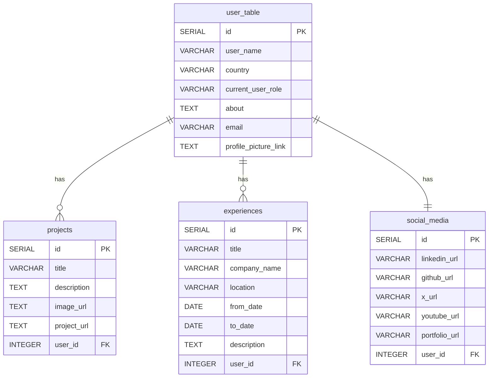

# Portfolio Backend

A simple Kotlin + Spring Boot REST API that powers a portfolio mobile app I will be working on(and possibly website). It exposes endpoints to manage Users, Projects, Work Experiences, and Social Media links, and persists data in PostgreSQL. The database schema is initialized automatically at application startup via schema.sql.

- Language/Framework: Kotlin, Spring Boot 3
- Build tool: Maven
- Database: PostgreSQL
- Port: 7080 (configurable)


## Quick start

Prerequisites:
- Java 17+
- Maven 3.9+
- PostgreSQL instance (local Docker or managed)

Environment variables used by Spring (see src/main/resources/application.yml):
- DB_PORT – Postgres port (e.g., 5432)
- DB_NAME – Database name (e.g., portfolio_db)
- DB_USERNAME – Database user
- DB_PASSWORD – Database password

Example: run Postgres locally with Docker
- docker run --name portfolio-postgres -e POSTGRES_PASSWORD=postgres -e POSTGRES_DB=portfolio_db -p 5432:5432 -d postgres:16
- export DB_PORT=5432
- export DB_NAME=portfolio_db
- export DB_USERNAME=postgres
- export DB_PASSWORD=postgres

Start the app
- mvn spring-boot:run
- The API will be available at http://localhost:7080

Note about database initialization
- Spring is configured with spring.sql.init.mode=always and JPA DDL is disabled (ddl-auto: none). On application startup, src/main/resources/schema.sql is executed to create tables if they do not exist.


## Initialization/Health-check endpoint

- GET /
  - Response (application/json):
    ```bash
      We are live 💪
    ```
  - Purpose: quick readiness check after startup (useful for smoke tests, container health checks, or initial verification that the service is running).


## API Endpoints

Base URL: http://localhost:7080

General response wrapper
- Many mutation endpoints return: { "message": "..." }

Users
- GET /user/all
  - Returns: List of users
- GET /user?userId=<id>
  - Returns: UserResponse
  - Response shape:
    ```json
    { "name": "...", "country": "...","role": "...", "social_media": null, "email": "...", "about": "..." }
    ```
- POST /user
  - Body (application/json):
    ```json
    { "id": 0, "name": "John Doe", "country": "KE", "role": "Software Engineer", "email": "john@example.com", "about": "About me" }
    ```
  - Response:
    ```json
    { "message": "User created successful" }
    ```

Projects
- GET /project/all?userId=<userId>
  - Returns:
    ```json
    [
      { "id": 1, "title": "...", "description": "...", "image_url": "...", "project_url": "..." }
    ]
    ```
- POST /project?userId=<userId>
  - Body:
    ```json
    { "title": "My App", "description": "...", "image_url": "https://...", "project_url": "https://..." }
    ```
  - Response:
    ```json
    { "message": "Project added successfully" }
    ```
- DELETE /project?projectId=<projectId>
  - Response:
    ```json
    { "message": "Project deleted successfully" }
    ```

Experience
- GET /experience/all?userId=<userId>
  - Returns:
    ```json
    [
      { "title": "...", "company_name": "...", "location": "...", "from_date": "2022-01-01", "to_date": null, "description": "..." }
    ]
    ```
- POST /experience?userId=<userId>
  - Body:
    ```json
    { "title": "Software Engineer", "company_name": "Acme", "location": "Nairobi", "from_date": "2022-01-01", "to_date": null, "description": "Built things" }
    ```
  - Response:
    ```json
    { "message": "Experience added successfully" }
    ```
- DELETE /experience?experienceId=<experienceId>
  - Response:
    ```json
    { "message": "Experience deleted successfully" }
    ```

Social media
- GET /social-media?userId=<userId>
  - Returns:
    ```json
    { "github_url": "...", "portfolio_url": "...", "x_url": "...", "linkedin_url": "...", "youtube_url": "..." }
    ```
- POST /social-media?userId=<userId>
  - Body:
    ```json
    { "github_url": "https://github.com/username", "portfolio_url": "https://me.example", "x_url": "https://x.com/handle", "linkedin_url": "https://linkedin.com/in/...", "youtube_url": "https://youtube.com/@..." }
    ```
  - Response:
    ```json
    { "message": "SocialMedia information added successfully" }
    ```

Notes
- For most operations, a valid userId must exist; otherwise the API responds with 404 Not Found.


## Database diagram



Entity notes
- The application uses repositories over JDBC; models map fields into the above tables. UserResponse aggregates optional social media for a given user.


## 🧪 Example cURL

```bash
# 🩺 Health Check
curl -i http://localhost:7080/

# 👤 Create User
curl -X POST http://localhost:7080/user \
  -H "Content-Type: application/json" \
  -d '{
    "name": "John",
    "country": "KE",
    "role": "Engineer",
    "email": "john@example.com",
    "about": "Hi"
  }'

# 📂 List Projects
curl "http://localhost:7080/project/all?userId=1"
```


## Contributing

Thank you for your interest in contributing! To propose changes:

1. Fork the repository to your GitHub account.
2. Create a feature branch from main: git checkout -b feat/short-description
3. Run the project locally and ensure endpoints work.
4. Make minimal, focused changes. Add or update documentation as needed.
5. If you add logic, consider adding tests under src/test/kotlin .
6. Ensure code compiles: mvn -q -DskipTests=false test
7. Commit with a clear message (e.g., feat: add delete project endpoint) and push your branch.
8. Open a Pull Request describing the change, rationale, and testing performed.

Code style & notes
- Kotlin 1.9.x, Java 17, Spring Boot 3.5.x
- Keep API contracts backward compatible when possible.
- Handle NotFoundException for missing resources consistently.

